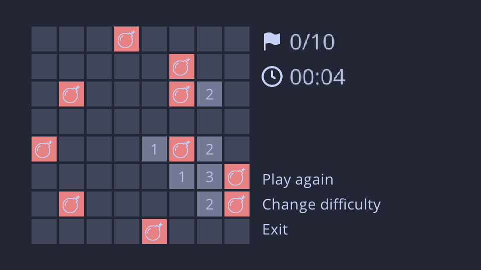

# Minesweeper

Minesweeper game made in C with raylib.

<p align=center>
  
</p>

## Quick Start
```bash
$ git clone https://github.com/Lookins01/minesweeper
$ cd minesweeper
$ ./build.sh
$ ./build/minesweeper
```

## Dependencies
* [raylib](https://www.raylib.com/)
